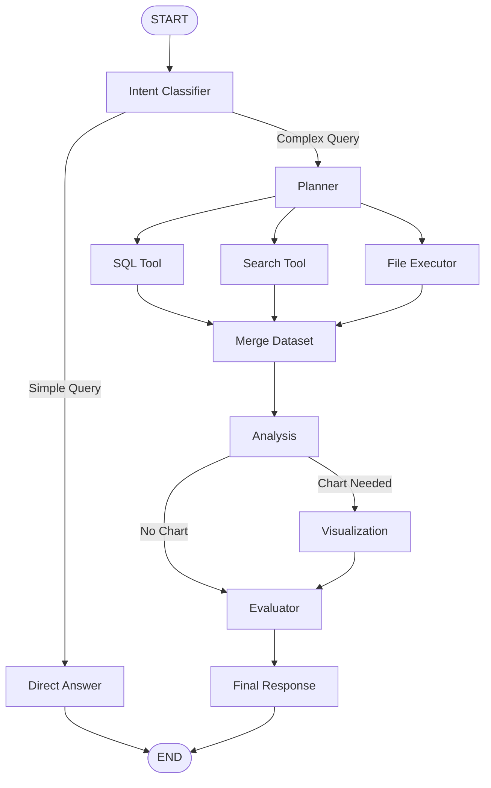

# Socrates AI — Multi-Agent Data Analysis System

Socrates AI is an advanced, multi-agent system designed for automated data analysis and visualization. It leverages the power of LangChain and LangGraph to coordinate a team of specialized AI agents that can query databases, analyze data, and generate charts, all exposed via a FastAPI backend and a Next.js frontend.

## Architecture



The project consists of three main components:

1.  **Frontend (`/ui`)**:
    *   A Next.js 15 application utilizing React 19.
    *   Built on top of the [agent-chat-ui](https://github.com/langchain-ai/agent-chat-ui) template by LangChain.
    *   Uses Tailwind CSS for styling and Radix UI primitives.
    *   Manages package dependencies with `pnpm`.

2.  **API (`/api`)**:
    *   A fast, async backend built with FastAPI.
    *   Serves as the bridge between the frontend user interface and the multi-agent graph.
    *   Run via Uvicorn.

3.  **Agent System (`/analyst`)**:
    *   Built using [LangGraph](https://github.com/langchain-ai/langgraph), enabling stateful, multi-actor applications with LLMs.
    *   Utilizes OpenAI models (default: `gpt-4o`) via LangChain.
    *   Equipped with data analysis tools including Pandas, NumPy, SciPy, Matplotlib, and Seaborn.
    *   Uses PostgreSQL for memory and checkpointing (`langgraph-checkpoint-postgres`).
    *   Generates charts and saves them in the `/charts` directory.

## Prerequisites

*   Python 3.12+ (uv recommended for dependency management)
*   Node.js and pnpm (for the frontend)
*   PostgreSQL database (for LangGraph checkpointing and state memory)
*   OpenAI API Key

## Getting Started

### 1. Environment Setup

Ensure the following key variables are set in your `.env`:
*   `OPENAI_API_KEY`: Your OpenAI API key.
*   `CHECKPOINT_POSTGRES_URL`: Connection string to your PostgreSQL instance.

### 2. Backend Setup

The project uses `uv` for Python dependency management.

```bash
# Install dependencies
uv sync

# Run the FastAPI server
uv run python main.py
```
The API will be available at `http://localhost:8000`.

### 3. Frontend Setup

Navigate to the `ui` directory and start the development server:

```bash
cd ui
pnpm install
pnpm dev
```
The frontend will be available at `http://localhost:3000`.

## Tech Stack

*   **Python Stack**: FastAPI, LangChain, LangGraph, SQLAlchemy, Pandas, Matplotlib, Seaborn.
*   **Web Stack**: Next.js (App Router), React, Tailwind CSS, TypeScript, pnpm.
*   **Database**: PostgreSQL (for both LangGraph state checkpointing and analytical databases).
